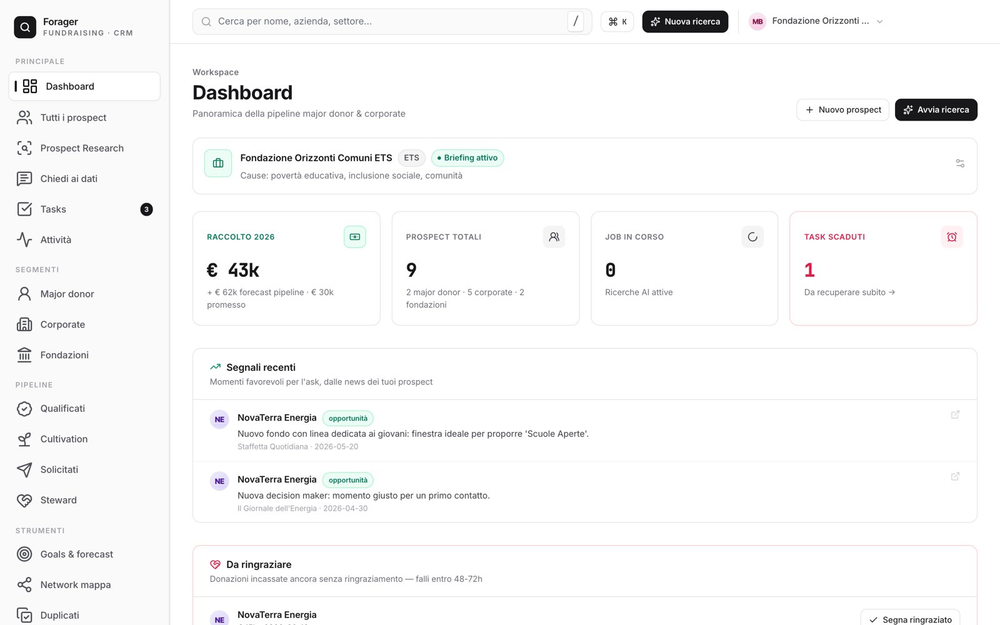
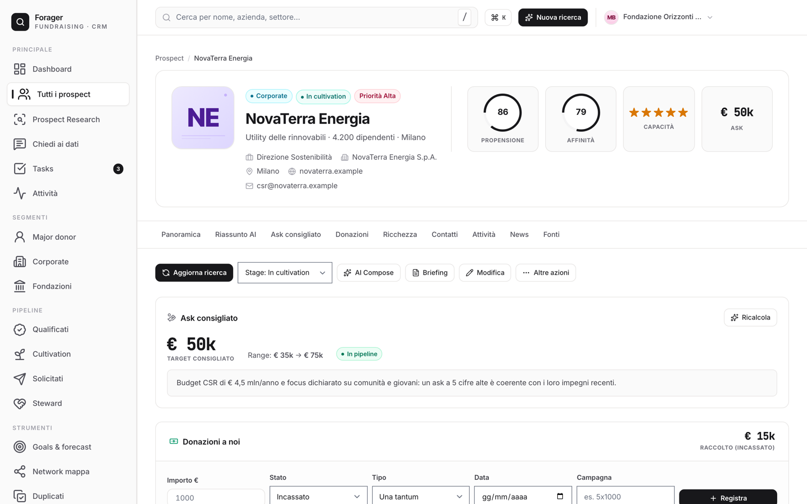
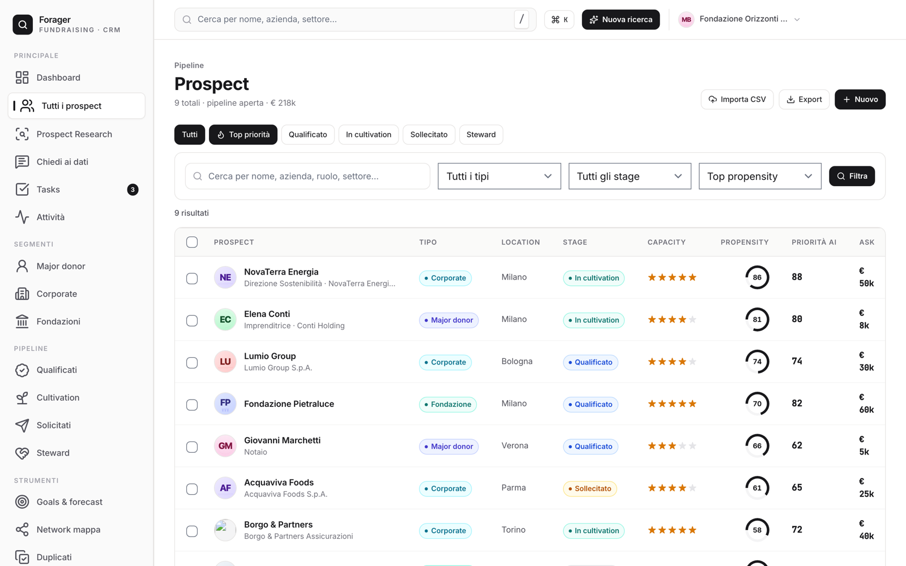
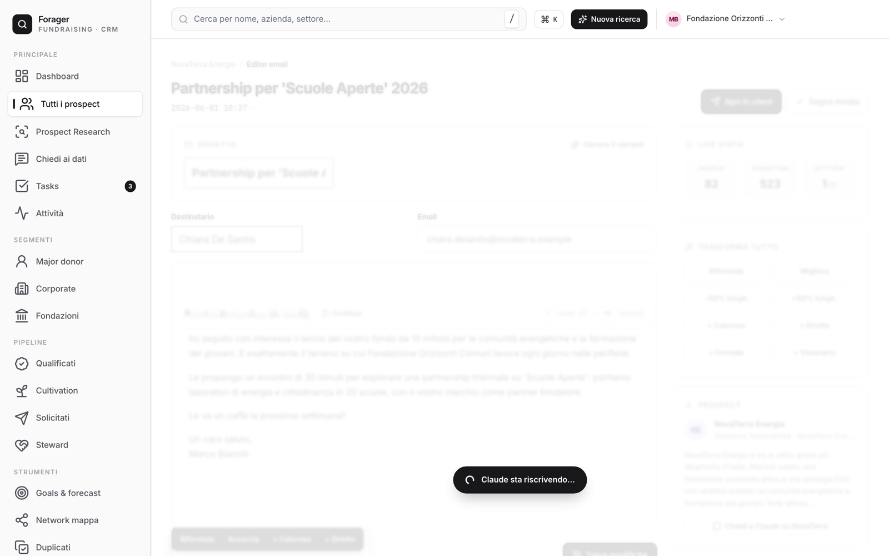
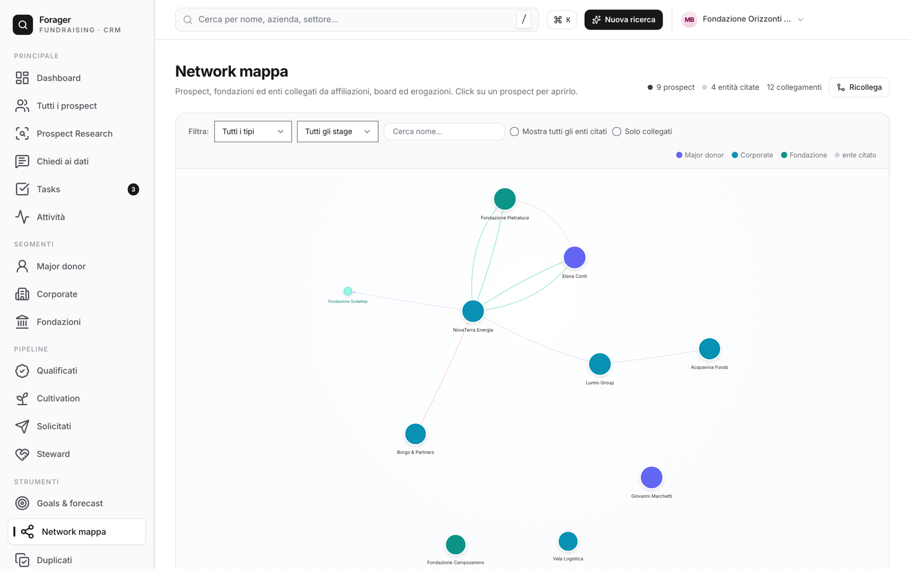

# Forager

**CRM open source per major donor e corporate fundraising**, pensato per organizzazioni
nonprofit, partiti, comitati referendari, fondazioni. Tutto in locale, niente cloud, niente abbonamenti
(eccetto Claude Code, vedi [Costi](#costi)).

Inserisci un nome → Claude esegue ricerca web pubblica, sintetizza un profilo strutturato (capacity, propensity, board, giving history, network), popola il CRM con fonti verificabili, suggerisce next-best-action allineata alle tue cause e ai tuoi tier ask. E poi ti accompagna nel ciclo completo: cadenze di ricontatto, registro donazioni reali, campagne, ringraziamenti, forecast.

📖 **[Guida completa](docs/GUIDA.md)** ([English](docs/GUIDE.en.md)) · la stessa guida è disponibile in-app.

---

## Screenshot



<table>
  <tr>
    <td width="50%">
      
      <p align="center"><sub><b>Scheda prospect</b> — score, ask consigliato, donazioni</sub></p>
    </td>
    <td width="50%">
      
      <p align="center"><sub><b>Pipeline</b> — capacity, propensity, priorità AI</sub></p>
    </td>
  </tr>
  <tr>
    <td width="50%">
      
      <p align="center"><sub><b>AI Compose</b> — bozze email contestualizzate</sub></p>
    </td>
    <td width="50%">
      
      <p align="center"><sub><b>Network</b> — relazioni tra prospect, board, fondazioni</sub></p>
    </td>
  </tr>
</table>

---

## Cosa fa

**Ricerca & intelligence**
- **Prospect research AI** — profilo generato da Claude su fonti pubbliche, con citazioni
- **Verifica fonti + grounding** — controlla che le fonti esistano E confermino i dati
- **Deep dive** per sezione (wealth, board, giving), **news con segnali** (opportunità/rischio)
- **Chiedi ai dati** — chat in linguaggio naturale sull'intero database
- **Network mapping** — grafo delle relazioni tra prospect, board e fondazioni

**CRM vero**
- **Pipeline 6 stage** con forecast pesato per probabilità
- **Registro donazioni** (incassato vs promesso) con deducibilità e ricevute (Italia)
- **Campagne** con obiettivo e raccolto attribuito
- **Cadenze di ricontatto** — coda "da ricontattare" in dashboard
- **Ciclo ringraziamenti** — coda "da ringraziare" dopo ogni gift
- **Cestino** — i prospect eliminati si recuperano
- **Tasks, tag, goals, activity feed, import/export CSV + JSON completo**

**Scrittura**
- **AI Compose** — bozze email contestualizzate al prospect + alla tua org
- **Sequenze** multi-step, esempi email, snippet riusabili

---

## Installazione

### Requisiti

- Python 3.10+
- [Claude Code CLI](https://docs.claude.com/claude-code) installato e autenticato (il "motore AI")
- macOS / Linux / Windows
- (opzionale) Account Hunter.io free per ricerca email decision maker

### One-liner (consigliato)

```bash
curl -fsSL https://raw.githubusercontent.com/Mic-Fundraiser/forager/main/install.sh | bash
```

### Installazione manuale

```bash
git clone https://github.com/Mic-Fundraiser/forager.git
cd forager
./forager init
./forager start
```

Il browser si apre automaticamente su <http://127.0.0.1:5000>.

### Windows

```cmd
git clone https://github.com/Mic-Fundraiser/forager.git
cd forager
forager.bat init
forager.bat start
```

### Docker (alternativa)

```bash
docker compose up -d
```

> **Nota**: dentro Docker l'AI engine Claude non è disponibile (richiede il binary host autenticato).
> Per usare la ricerca AI, esegui Forager nativamente con `./forager start`.
> La porta è pubblicata solo su `127.0.0.1` perché l'app non ha autenticazione: per accesso
> remoto usa un reverse proxy con auth o una VPN.

---

## Costi

Forager è gratuito (MIT). Il motore AI è il CLI di **Claude Code, che è un servizio a pagamento
di Anthropic**: Forager lo invoca in locale usando il TUO abbonamento — nessuna chiave passa da noi,
nessun costo aggiuntivo oltre a quello che già paghi ad Anthropic. Ogni azione AI è esplicita
(niente chiamate automatiche in background) e la pagina **Consumo AI** ti mostra quanto usi.
Hunter.io è opzionale e ha un piano gratuito (25 ricerche/mese).

---

## CLI

```
./forager start       Avvia il server e apre il browser
./forager init        Setup iniziale (venv + dipendenze + db)
./forager doctor      Diagnostica configurazione
./forager backup      Salva un backup del database in backups/
./forager restore     Ripristina un backup
./forager update      Aggiorna codice e dipendenze
./forager help        Aiuto
```

---

## Configurazione

Tutto è opzionale — Forager funziona out-of-the-box. Per personalizzare, copia `.env.example` in `.env`:

```bash
cp .env.example .env
```

Variabili principali:

| Variabile | Default | Cosa fa |
|---|---|---|
| `FORAGER_PORT` | `5000` | Porta del web server |
| `FORAGER_HOST` | `127.0.0.1` | `0.0.0.0` per rete locale (sconsigliato: nessuna auth) |
| `FORAGER_SECRET_KEY` | auto | Generata e salvata in `data/.secret_key` al primo avvio |
| `HUNTER_API_KEY` | vuota | Tua chiave [hunter.io](https://hunter.io) (free tier OK) |
| `HUNTER_SENIORITY` | `executive` | Filtro decision maker (`executive`/`senior`/`junior`) |
| `CLAUDE_BIN` | auto | Path al binary `claude` se non nel PATH |

---

## Primo utilizzo

1. Apri <http://127.0.0.1:5000> — la prima volta vedi il **wizard di benvenuto**: inserisci nome org, mission, cause, ask tipici (60 sec)
2. Vai su **Prospect Research** → inserisci il nome di un prospect → in 1–3 minuti il profilo è completo
3. Apri il profilo → modifica stage, imposta la **cadenza di ricontatto**, registra le **donazioni**, genera bozze con AI Compose
4. Crea le tue **campagne** e collega le donazioni: la dashboard ti dice cosa rende
5. Da **La mia org** rifinisci il briefing (più dettagli = ricerche più mirate)

---

## Troubleshooting

**"Il CLI claude non risulta installato"** (banner giallo in dashboard)
```bash
npm install -g @anthropic-ai/claude-code
claude   # primo avvio: login con il tuo account Anthropic
```
Poi riavvia Forager. Se `claude` è installato ma non nel PATH, imposta `CLAUDE_BIN=/percorso/claude` in `.env`.

**Export PDF non funziona su macOS** — WeasyPrint richiede librerie di sistema:
```bash
brew install pango libffi
```
In alternativa usa "Stampa → Salva come PDF" dal browser (pulsante Stampa nella scheda), che non richiede nulla.

**Hunter dice "Errore"** — apri Settings: il messaggio ti dice se la chiave manca, è scaduta o la quota è finita.

**"Database is locked"** — chiudi eventuali doppi avvii di Forager (`./forager start` due volte). WAL e retry sono già attivi.

**La porta 5000 è occupata** (su macOS spesso è AirPlay) — `FORAGER_PORT=5001` in `.env`.

**Diagnostica completa**: `./forager doctor`

---

## Privacy & dati

- **Tutto in locale**: database SQLite in `data/crm.db`. Nessun cloud, nessuna telemetria.
- **I dati sono tuoi**: export CSV (prospect, donazioni) e **dump JSON completo** da Settings. Zero lock-in.
- **Backup automatico** ogni 24h in `backups/` (rotazione 14) + `./forager backup` manuale.
- **Ricerca AI**: i prompt passano via Claude Code CLI (il tuo abbonamento Anthropic).
- **Hunter**: se configurato, riceve solo i domini aziendali che cerchi.
- **Avatar e loghi**: generati in locale (SVG) — nessuna chiamata a servizi terzi.
- **Frontend offline**: tutte le librerie sono servite in locale (`static/vendor/`), l'interfaccia funziona senza internet.

---

## Etica

- Usa **solo fonti pubbliche**: stampa, registri imprese, biografie istituzionali, comunicati ufficiali, LinkedIn pubblico, atti di fondazioni.
- **Rispetto GDPR**: profila solo persone con esposizione pubblica e finalità legittime di interesse (fundraising trasparente).
- **Capacity stimata = stima**: verifica sempre prima di un ask formale.
- **Criteri di esclusione**: definiscili in "La mia org" → Claude flaggerà red flags se il prospect cade nei tuoi tabù (settori, conflitti d'interesse).

---

## Stack

- **Backend**: Python 3, Flask, SQLite (zero dipendenze esterne pesanti)
- **AI engine**: Claude Code CLI in subprocess (usa il tuo abbonamento, niente API key Anthropic)
- **Frontend**: Tailwind CSS, Lucide icons, HTMX, Alpine.js — tutto servito in locale, zero build step
- **Search email**: Hunter.io API (opzionale)
- **Sicurezza**: CSRF su tutte le POST, secret key auto-generata, bind solo su localhost, Docker non-root

---

## Test

```bash
python -m pytest tests/ -q
```

Smoke test su schema, route principali e protezione CSRF. CI su GitHub Actions a ogni push.

---

## Contribuire

Vedi [CONTRIBUTING.md](CONTRIBUTING.md). Pull request benvenute. Aree dove serve aiuto:

- Video e GIF per la documentazione
- Traduzioni interfaccia (FR, ES, DE)
- Integrazioni: Pipedrive, HubSpot, Salesforce Nonprofit
- Mobile responsive refinements
- Dataset open per benchmark (donor pubblici)

---

## License

MIT — vedi [LICENSE](LICENSE).

---

## Crediti

Built for the Italian nonprofit community. Inspired by [DonorSearch](https://www.donorsearch.net),
[iWave](https://www.iwave.com), [Affinity](https://www.affinity.co).
